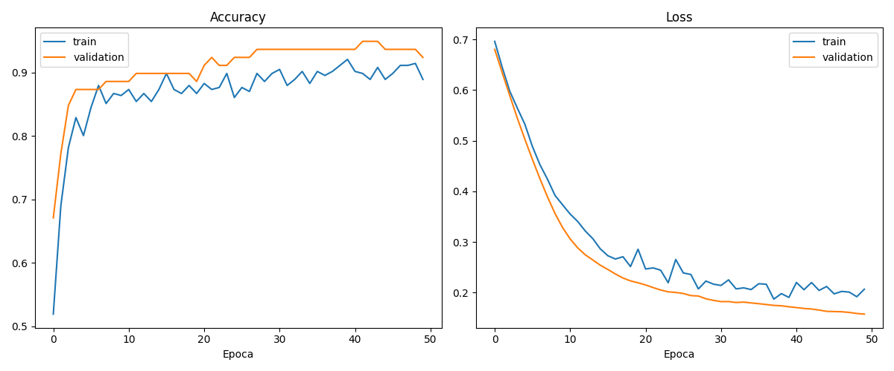
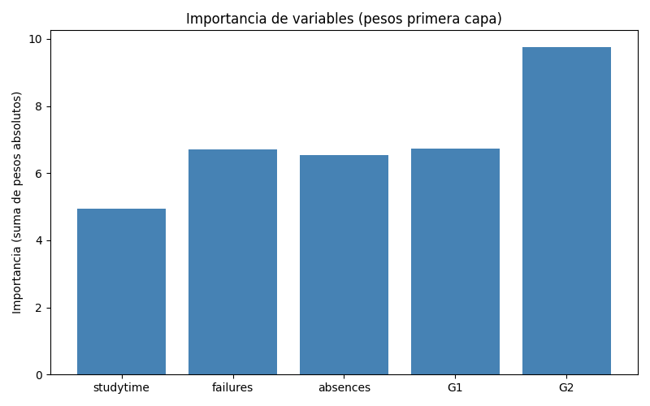

## 1. Planteamiento del problema

La desercion y el bajo rendimiento academico son problemas recurrentes en
las instituciones educativas, y suelen detectarse cuando ya es dificil
revertirlos: el boletin de notas llega despues de que el daño esta hecho.
Este proyecto desarrolla SIPRE, un sistema que estima a partir de datos
academicos si un estudiante esta en riesgo de reprobar, con el fin de darle
al tutor una señal temprana para intervenir a tiempo. Se plantea como un
problema de clasificacion binaria: riesgo (1) o estable (0).

## 2. Analisis exploratorio de datos (EDA)

Se utilizo el dataset Student Performance de la UCI (`student-mat.csv`, 395
estudiantes, 33 columnas), separado por punto y coma. Contiene notas por
periodo (G1, G2, G3), tiempo de estudio, ausencias, materias reprobadas y
otros factores del entorno del estudiante. Para este proyecto se trabajo
unicamente con cinco variables de entrada: studytime, failures, absences,
G1 y G2; G3 se reservo para construir la etiqueta y no se uso como entrada
del modelo.

Al aplicar el criterio G3 < 10, 130 de los 395 estudiantes (32.9%) quedaron
clasificados como en riesgo y 265 (67.1%) como estables. Hay un desbalance
de aproximadamente 2 a 1 a favor de la clase estable, esperable en un curso
donde la mayoria aprueba. Esta misma proporcion se conserva en el conjunto
de prueba (53 estables y 26 en riesgo, ver seccion 3), gracias al split
estratificado, lo que evita que la evaluacion quede sesgada por un
conjunto de prueba con una distribucion distinta a la real.

## 3. Preparacion y limpieza de datos

Los datos se cargaron con separador punto y coma. Se creo la variable
objetivo "riesgo": vale 1 si la nota final G3 es menor a 10 (reprobado) y
0 si es 10 o mas (aprobado). Luego se dividieron los datos en 80% para
entrenamiento y 20% para prueba, manteniendo la misma proporcion de
estudiantes en riesgo en ambos grupos para que la evaluacion sea justa.

## 4. Ingenieria de caracteristicas (Feature Engineering)

Se seleccionaron cinco variables por su relacion directa con el rendimiento:
tiempo de estudio, materias reprobadas antes, ausencias y las notas de los
dos primeros periodos. Se elimino G3 de las entradas de forma intencional:
como el riesgo se calcula a partir de G3, dejarla haria que la red
"adivinara" con trampa. Ademas, se aplico StandardScaler para que todas las
variables quedaran en la misma escala (media 0, desviacion 1), evitando que
las ausencias (0 a 93) dominaran sobre el tiempo de estudio (1 a 4).

## 5. Entrenamiento del modelo

Se construyo una red neuronal tipo MLP (perceptron multicapa) con Keras:
una capa densa de 32 neuronas con activacion relu, un Dropout de 0.3 para
reducir el sobreajuste, una segunda capa densa de 16 neuronas relu y una
neurona de salida con activacion sigmoide que entrega la probabilidad de
riesgo. Se entreno con el optimizador Adam y la funcion de perdida binary
crossentropy durante 50 epocas.

En las curvas de entrenamiento, el loss de validacion baja junto con el de
entrenamiento a lo largo de las 50 epocas sin volver a subir, y el accuracy
de validacion se estabiliza cerca del accuracy de entrenamiento hacia el
final. Esa cercania entre ambas curvas es el indicio de que el modelo esta
generalizando y no memorizando el conjunto de entrenamiento.

## 6. Evaluacion y metricas

El modelo alcanzo los siguientes resultados en el conjunto de prueba (79
estudiantes):

- Accuracy: 92%
- Precision: 88.5%
- Recall: 88.5%
- F1-Score: 88.5%

La matriz de confusion sobre el conjunto de prueba es la siguiente:

| | Predicho: Estable | Predicho: Riesgo |
|---|---|---|
| **Real: Estable** | 50 | 3 |
| **Real: Riesgo** | 3 | 23 |

En la diagonal estan los aciertos: 50 estudiantes estables y 23 en riesgo
fueron clasificados correctamente, es decir 73 de 79 (el 92% de accuracy).
Fuera de la diagonal estan los dos tipos de error, y quedaron parejos: 3
estudiantes estables fueron marcados como en riesgo (falsos positivos) y 3
estudiantes en riesgo fueron marcados como estables (falsos negativos). El
F1 de 88.5% confirma ese equilibrio entre precision y recall, y el reporte
por clase da 0.94 de F1 para "estable" y 0.88 para "riesgo", lo que indica
que el modelo distingue bien ambos grupos.

## 7. Interpretacion de resultados

La importancia de cada variable se estimo sumando el valor absoluto de los
pesos de la primera capa asociados a esa entrada. G2 (nota del segundo
periodo) resulto la variable con mayor peso, seguida de failures (materias
reprobadas previamente). Es un resultado consistente con el sentido comun
academico: la nota mas reciente y el historial de reprobacion son mejores
predictores del riesgo que factores mas indirectos como las ausencias o el
tiempo de estudio declarado.

Frente a los errores de la seccion anterior, el modelo mantiene un recall
de 0.94 en la clase estable y 0.88 en la clase riesgo: los 3 falsos
negativos son estudiantes en riesgo que el modelo no detecto. En un
contexto de apoyo tutorial, un falso negativo pesa mas que un falso
positivo, porque el falso positivo solo implica una revision de mas para
un estudiante que en realidad esta bien, mientras que el falso negativo
deja sin intervencion a alguien que si va a reprobar. Por eso, si el
sistema se pusiera en uso real, convendria mover el umbral de decision
para priorizar recall sobre precision en la clase riesgo, aunque eso
implique aceptar mas falsos positivos.

## 8. Conclusiones y recomendaciones

El sistema cumple el objetivo planteado: clasifica correctamente al 92% de
los estudiantes del conjunto de prueba, con un F1 de 88.5% que confirma un
balance razonable entre precision y recall. Las notas parciales (G2) y el
historial de materias reprobadas resultaron ser las señales mas relevantes
para el modelo, por encima de las ausencias y el tiempo de estudio
declarado.

Dado que el modelo aun deja pasar algunos falsos negativos (seccion 7), se
recomienda usarlo como una herramienta de apoyo a la decision del tutor y
no como un diagnostico definitivo: la decision final sobre una intervencion
debe seguir siendo del criterio humano, con el modelo como una señal de
alerta temprana entre otras que el tutor puede considerar.

## Implementacion: aplicacion interactiva

Como interfaz de uso se desarrollo una aplicacion web con Streamlit (SIPRE,
`app/app.py`) donde el usuario ajusta con controles deslizantes los cinco
datos de entrada del estudiante (tiempo de estudio, materias reprobadas,
ausencias, G1 y G2) y obtiene la prediccion al presionar el boton
"Predecir". La app carga una sola vez el modelo entrenado (`model.h5`) y el
`scaler` guardados, normaliza la entrada con el mismo `StandardScaler` usado
en el entrenamiento, y muestra el resultado en un cuadro rojo ("Riesgo
Detectado") o verde ("Estudiante Estable"), junto con el porcentaje de
probabilidad.

Esta interfaz no reemplaza el analisis del tutor: su funcion es dar una
lectura rapida del riesgo estimado para un estudiante puntual, a partir de
datos que el tutor ya tiene a mano.

## 9. Trabajo futuro

Como mejoras futuras se propone: incluir mas variables (situacion familiar,
apoyo escolar), probar con mas datos de otros cursos, ajustar el umbral de
decision para reducir falsos negativos, y añadir una explicacion por
estudiante que muestre al tutor por que fue marcado en riesgo.
